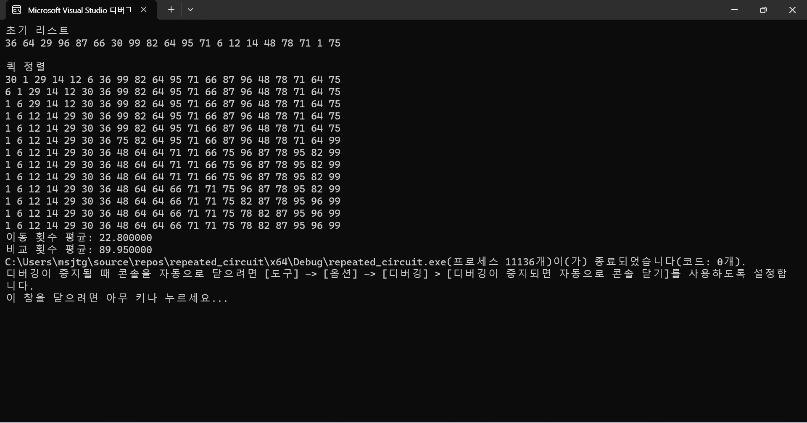

#비교분석

#시간복잡도는 쉘정렬이 평균적으로 O(𝑛^1.5), 합병정렬과 퀵정렬은 O(n*log(n)), 그리고 버블정렬은 O(n²)이다.
#각각의 알고리즘을 20번씩 돌린 비교횟수의 평균은  쉘정렬(26), 합별정렬(62), 퀵정렬(89.95), 버블정렬(174)으로 측정되었다.
#이동횟수의 평균으로는 퀵정렬(22.8), 쉘정렬(48), 합병정렬(88), 버블정렬(89)으로 측정되었다.

#비교횟수의 경우 시간복잡도가 큰 순서데로 실제로 측정된 결과가 크게 나왔다는것을 알수있었고, 이동횟수의 경우 쉘정렬이 퀵정렬보다 적게 이동된것으로 확인되었지만 이는 배열의 길이가 짧은것과 랜덤으로 배열을 생성할때 얼마나 정렬이 되어있었는지가 원인이 된것같다.

#퀵정렬

